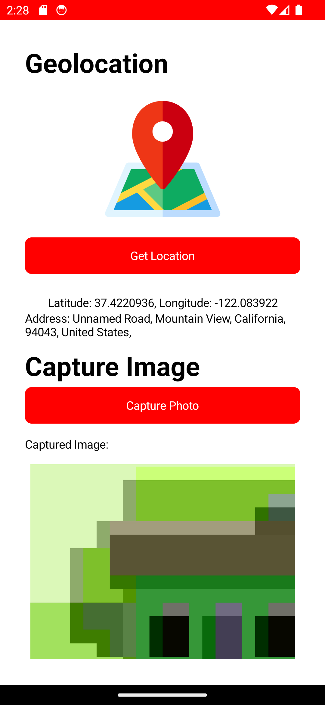

# Module04 - Activity01 (PDC50-LAB)

    Name of Student: Elmalia Jane S. Diaz
    Year and Section: BSIT4A
    Activity Title: Module04 - Activity01
    Date Submitted: September 25, 2024

## Photo Capture and Location Tagging
### Source Code
- [MainPage.xaml](Module04Activity01/MainPage.xaml)
- [MainPage.xaml.cs](Module04Activity01/MainPage.xaml.cs)
### Output Screenshots

    
    

